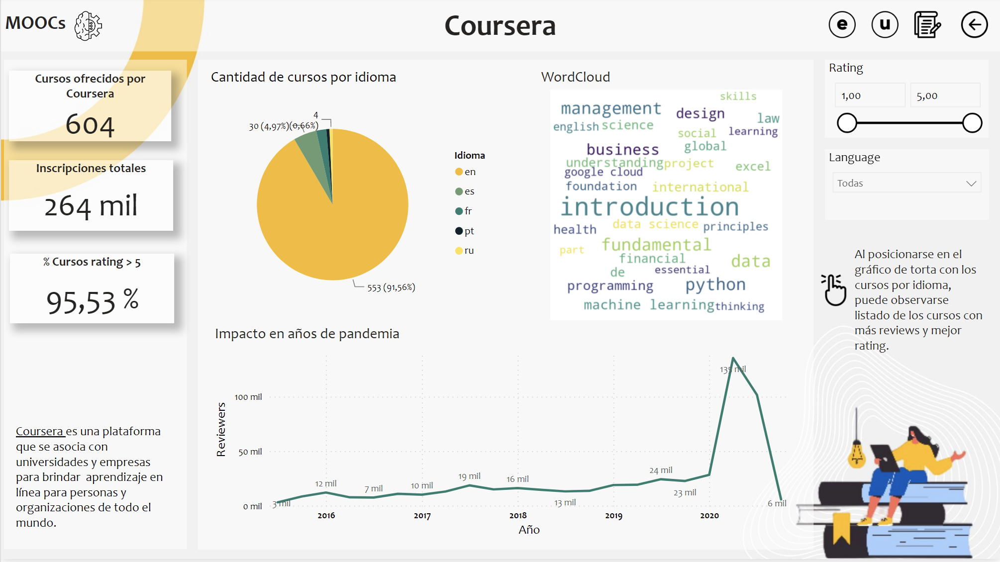
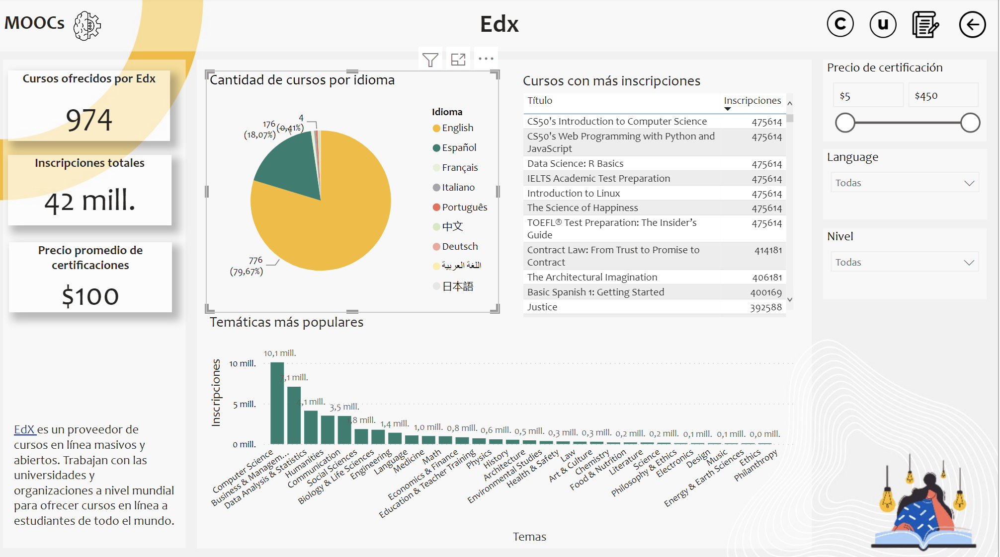
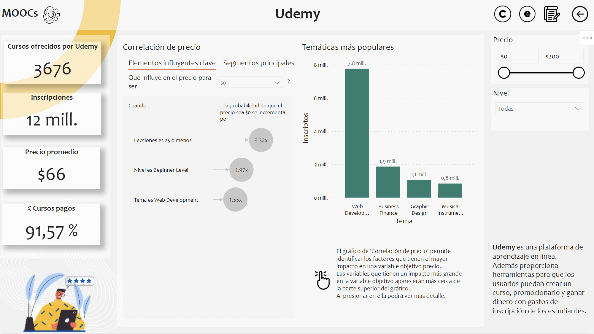
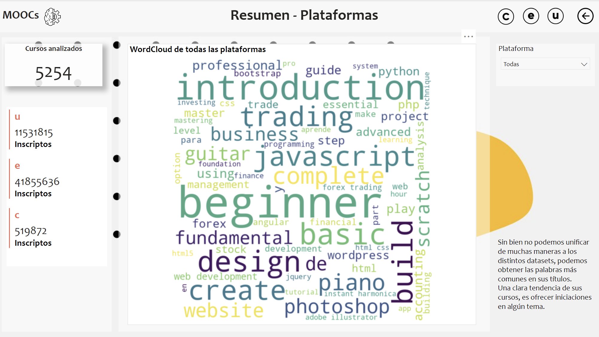

# <h1> **PROYECTO INDIVIDUAL Nº3** </h1>

 

¡Hola! Soy *Yamila Galiano* y este es mi tercer proyecto del bootcamp de Data Science en SoyHenry, enfocado en Data Analyst.

  

[Consigna completa del LAB - Cohorte 06](https://github.com/soyHenry/PI03-Analytics)  
### Objetivo
A partir de varios datasets, realizar un EDA a los datos y generar un Dashboard con su respectivo análisis fundamentando las recomendaciones sugeridas a partir de el. 

### Contexto
Como parte del área de Data Analitycs de una empresa se nos solicita realizar un trabajo para una s​tartup de tecnología interesada en sumarse al mercado de cursos online de forma eficiente. Se solicitan los siguientes puntos:

- Segmentar el nivel de ventas según precio, idioma, nivel y rating de cada curso para determinar como influyen dichas variables en la demanda del producto vendido.

- Por otra parte se nos solicita un WordCloud de las palabras clave que más se repiten dentro del título.

- Dashboard y las conclusiones/recomendaciones de nuestra parte.

- Establecer al menos 1 KPI producto de su análisis y que el mismo se pueda visualizar en un dashboard. 

### Tecnologías utilizadas
* [Python](https://docs.python.org/3/)
* [Pandas](https://pandas.pydata.org/)
* [Power BI](https://powerbi.microsoft.com/es-es/)

### Tareas realizadas
#### 1. EDA - Análisis Exploratorio de los datos.
- Analizamos tipos de datos y nulos para eliminar o remplazar.
- Corregimos tipos de datos. Cambiamos tipo de dato en columna price y n_enrolled y volvimos la columna course_length un int en weeks para trabajarlo como un entero. 
- Quitamos duplicados.
- Unimos los dos datasets de Coursera. Dejamos uno para analizar reviews sin duplicados y otro con los course_id, cantidad de reviews y promedio de rating. 
- Exploramos la descripción de los datos y sus posibles relaciones. 
- Detectamos outliers y normalizamos. 
- Agregamos el idioma del curso en el dataset Coursera, con relación a su review.
- Generamos un datasets con los title de cada dataset e importamos a csv.
- Generamos wordcloud con las palabras en tittle. 

#### 2. Dashboard.
Link con el archivo: https://drive.google.com/drive/folders/1aqn6qdpijZWTmdElajg4WAEhBrrEhes3?usp=sharing
- Generamos un dashboard con una hoja para cada plataforma de curso y una hoja de resumen para demostrar el análisis general.
- Creamos medidas de cantidad de cursos en general, cantidad de cursos con rating positivo. 
- Generamos una página de herramientas para Coursera.
- Agregamos las imagenes de WordCloud en el dashboard. 

Inicio

Coursera

Edx

Udemy

All platforms

#### 3. Análisis: 
Pudimos obtener la siguiente información después del análisis realizado:
- Del total de cursos con información de su idioma, un 85% de ellos dicta sus cursos en Ingles. Por lo tanto es un buen punto de comiezo, para abarcar mercado innternacional con mayor facilidad. 
- El incremento de cursos en los años de pandemia, nos brindan un pantallazos del crecimiento que tubo el rubro y cuan fuerte se encuentra en este momento. 
- Del total de cursos con el dato de temática, se puede ver una tendencia del mundo IT. Es uno de los mercados que necesita constantemente capacitaciones y un bueno comienzo sería enfocarse en esa temática. Luego de IT, se encuentro el rubro de Business, otro punto fuerte para enfocarse en generar cursos. 
- Lo que más afecta al factor precio, son las certificaciones y la cantidad de lecciones que abarque. Es decir, que mientras más largo sea el curso, más costo tiene. 
- Respecto a todas las plataformas pudimos validar que tienen una fuerte tendencia a dar iniciaciones o comienzo de una tematica en particular. Como iniciativa no es necesario entonces generar cursos avanzados de los temas seleccionados, lo ideal es iniciar con puntos claves y más aptos para todos los clientes. 
Otros títulos destacados son 'Javascript', un lenguaje de desarrollo con fuerte crecimiento en este momento. Le siguen 'Trading', una temática actual para las personas que desean desarrollarse en ese mercado. 

#### 4. KPIs: 
- Cantidad de cursos analizados y ofrecidos por cada plataforma.
- Porcentaje de cursos con reviews positivos. 
- Inscripciones totales en cada plataforma. En el caso de Coursera, tomamos el parametro de Reviewers como Inscripciones ya que sería un aproximado. 
- Porcentaje de cursos pagos. 
- Precio promedio de cursos. 

 
Contacto:  
   
